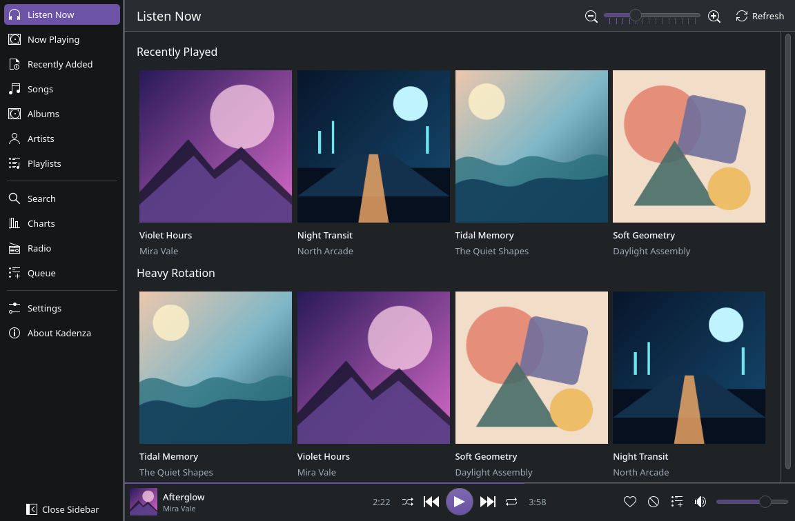
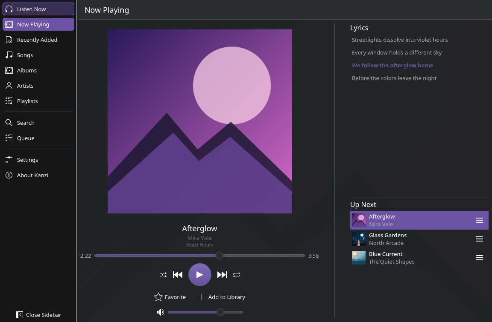
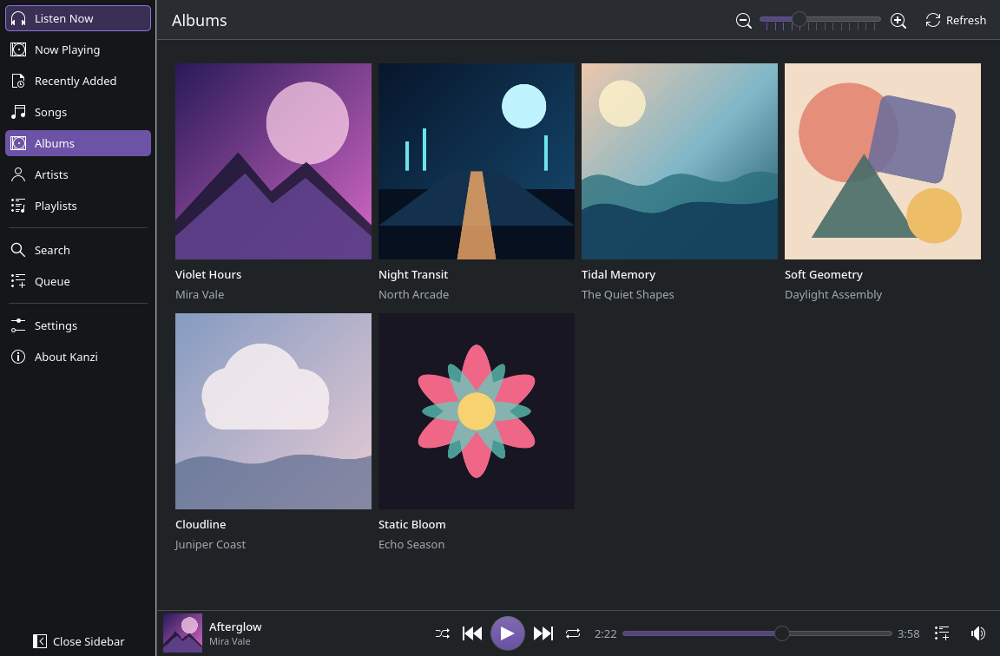
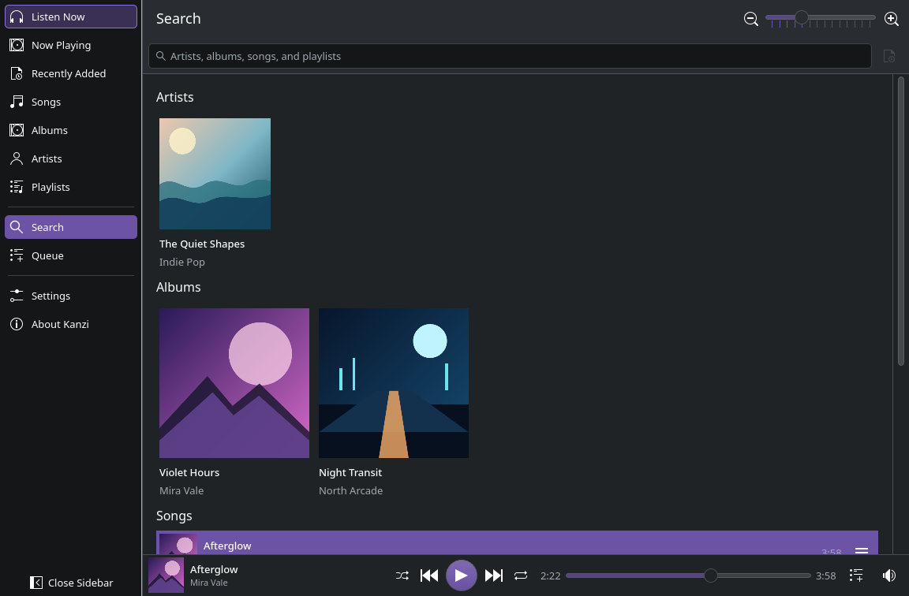

# Kanzi

Kanzi is a native Apple Music client for KDE Plasma, built with Qt 6,
Kirigami, and KDE Frameworks 6.

## Screenshots

| Listen Now | Now Playing |
| --- | --- |
| [](docs/screenshots/listen-now.png) | [](docs/screenshots/now-playing.png) |

| Albums | Search |
| --- | --- |
| [](docs/screenshots/albums.png) | [](docs/screenshots/search.png) |

The visible application is native. It talks directly to the Apple Music REST
API for library and catalog data. Full-track playback is delegated to one
hidden [castLabs Electron for Content Security](https://github.com/castlabs/electron-releases)
process running Apple's MusicKit player and Google's Widevine CDM. The sidecar
is shown only while Apple's own sign-in requires interaction.

## Features

- Recently played and heavy rotation
- Recently added albums, ordered newest-first across the whole library
- Songs, albums, artists, and playlists from the user's library
- Grouped search across the Apple Music catalog or your own library, with
  autocomplete suggestions and recent searches
- Artist pages with latest release, top songs, albums, singles and similar
  artists
- Personalised recommendations and recently played songs on Listen Now
- Top songs, albums and playlists from the Apple Music charts
- Love and dislike ratings for songs, albums, playlists and stations, shown on
  tracks, tiles and detail pages, and fed back to Apple's recommendations
- Apple Music radio stations, played through the sidecar
- Album, playlist, and artist detail pages
- Favorites, library management, playlist creation, and add-to-playlist actions
- A dedicated Now Playing view with artwork, synchronized lyrics, and Up Next
- Reorderable queue, seek, volume, shuffle, and repeat controls
- Restored queue and playback position between launches (paused until resumed)
- KDE media controls through MPRIS, global media shortcuts, track notifications,
  desktop jump-list actions, and optional system-tray operation
- Persistent Apple session in an isolated Electron profile
- Adaptive single-pane Kirigami navigation for compact windows

An active Apple Music subscription, network access, and an x86-64 Linux system
are required for full playback. Widevine on Linux does not provide persistent
licenses, so offline playback is not available.

## Build

Install Qt 6.8+, KDE Frameworks 6, Kirigami, CMake, Ninja, Node.js 22.12+ and
npm. Then install the playback runtime and build Kanzi:

```sh
npm --prefix sidecar install
cmake -S . -B build -G Ninja -DCMAKE_BUILD_TYPE=Release
cmake --build build
./build/kanzi
```

Use `KANZI_SHOW_SIDECAR=1 ./build/kanzi` to keep the playback window visible
while diagnosing MusicKit or DRM problems. `KANZI_SIDECAR=/path/to/sidecar`
overrides sidecar discovery.

Kanzi looks for its Widevine-enabled Electron runtime in three places, in
order: `KANZI_ELECTRON=/path/to/electron`, the sidecar's own bundled copy
(`npm --prefix sidecar install`, above), and `electron43-castlab` on `PATH`
(the binary installed by the AUR package `electron43-castlab-bin`). The Arch
package depends on that AUR package instead of bundling a second ~150MB copy;
the .deb, .rpm and Flatpak still bundle it, since none of those ecosystems
have an equivalent shared package.

`KANZI_TRACE=1` echoes the sidecar protocol to stderr, `>>` for commands Kanzi
sends and `<<` for events it receives. The two directions are separate pipes,
so one can work while the other is silent — which is what a player that plays
audio but reports nothing looks like.

The checked-in screenshots are captures of Kanzi's built-in, fictional demo
library. To regenerate one without an Apple account:

```sh
mkdir -p /tmp/kanzi-shots && cp ~/.config/kdeglobals /tmp/kanzi-shots/
XDG_CONFIG_HOME=/tmp/kanzi-shots QT_QPA_PLATFORM=offscreen QT_QPA_PLATFORMTHEME=kde \
  KANZI_DEMO=1 KANZI_DEMO_PAGE=home \
  KANZI_SCREENSHOT="$PWD/docs/screenshots/listen-now.png" ./build/kanzi
```

`QT_QPA_PLATFORMTHEME=kde` matters: without it the offscreen platform falls back
to a light Qt palette while Kirigami still resolves a dark colour scheme, so
every themed icon is recoloured almost black and the capture looks broken. The
throwaway `XDG_CONFIG_HOME` keeps personal settings such as the album art size
out of the published captures while still picking up the desktop colour scheme.

The offscreen platform has no shader pipeline, so artwork rounding and the
circular artist portraits are not exercised by such a capture — `ArtworkImage`
deliberately falls back to square pictures wherever the scene graph is running
in software. To capture those, run on a real graphics stack instead
(`QT_QPA_PLATFORM=xcb QSG_RENDER_LOOP=basic`); the basic render loop keeps
animations advancing while the window is being grabbed. `KANZI_SCREENSHOT_DELAY`
sets how long to wait, in milliseconds, before grabbing (2500 by default), since
artwork loads asynchronously and then fades in.

Use `now-playing`, `albums`, or `search` as `KANZI_DEMO_PAGE` to capture the
other documented views. Demo data, artwork, and lyrics are fictional.

## Local library cache

Recently Added is fetched from Apple's dedicated
`/v1/me/library/recently-added` resource, which returns newest-first, and the
walk stops after the newest couple of hundred items. `/v1/me/library/albums` is
documented as alphabetical with no `sort` parameter, so deriving Recently Added
from the album library instead would mean paging through the whole thing before
the first row could be shown.

Kanzi also keeps a SQLite mirror of the library at
`~/.local/share/kanzi/kanzi.sqlite`. Every library view renders from disk
immediately and pages out of SQLite rather than the network. A background
refresh runs once per launch, again when the cached copy is older than six
hours, and whenever you press Refresh.

The cache schema is versioned with `PRAGMA user_version` and migrated in place
on open, so an existing cache gains new columns without being rebuilt.

Each walk is stamped with a sync epoch; rows left at an older epoch are deleted
when the walk finishes. A sync that is interrupted never calls that final step,
so a partial result can never look like a library that suddenly shrank. Signing
out deletes the cache.

## Architecture and security

Kanzi never receives an Apple ID password or two-factor authentication value.
Apple's form is rendered by Apple inside the sidecar. Navigation is restricted
to Apple and Apple CDN origins, unnecessary browser permissions are denied,
and the Music User Token is held in memory rather than written by the native
application. Apple's browser cookies and web storage are retained in Electron's
isolated Kanzi profile so a valid session is restored across launches. Using
Sign Out clears that profile data.

Restoring that session needs one extra step. Apple sets its `media-user-token`
cookie on the host that handles sign-in, not on `music.apple.com`, which is the
host the web player reads — so a profile that had signed in still came back
signed out, and MusicKit stayed unauthorized and played 90-second previews. On
startup the sidecar copies that cookie onto the player's own domain. The token
still never leaves Electron's profile.

The sidecar code is derived from
[Slipmat](https://github.com/SoftARV/Slipmat) by Miguel Rincon and retains its
copyright notice. Kanzi is not affiliated with or endorsed by Apple.

## License

GPL-3.0-or-later.
